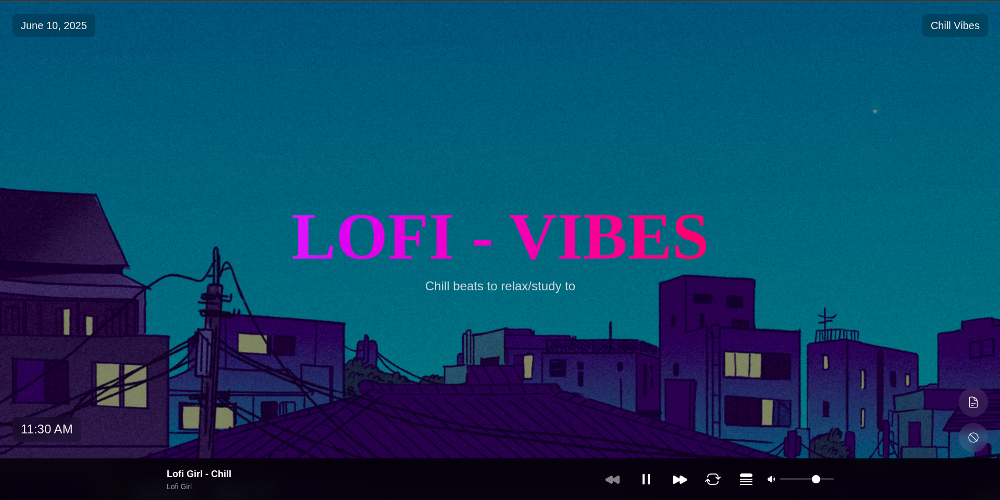
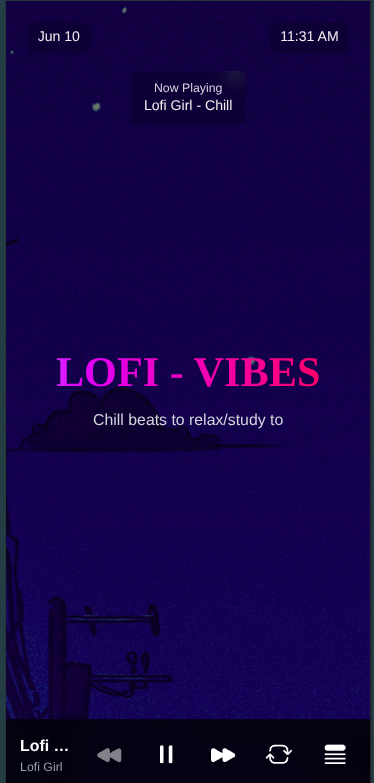

<div align="center">
  <h1>LOFI VIBES</h1>
  
  <br/>
  <p><strong>A minimalist lofi music web app for your coding and study sessions</strong></p>
  <!-- <a href="https://github.com/dhunganaPradeep/lofi-vibes/stargazers">
    
  </a>
  <a href="https://github.com/dhunganaPradeep/lofi-vibes/network/members">
    
  </a>
  <a href="https://github.com/dhunganaPradeep/lofi-vibes/issues">
    
  </a>
  <a href="https://github.com/dhunganaPradeep/lofi-vibes/blob/main/LICENSE">
    
  </a> -->
</div>

## 📱 Screenshots

<div align="center">
  <h3>Desktop View</h3>
  
  
  <h3>Mobile View</h3>
  
</div>

## ✨ Features

- Curated lofi music playlists for maximum productivity
- Beautiful dynamic wallpapers with smooth transitions
- Built-in sticky notes for quick thoughts and tasks
- Progressive Web App (PWA) for native app experience
- Super lightweight and blazing fast
- Offline support for uninterrupted sessions
- Clean, minimalist UI design

## 🎯 Live Demo

Try it out: [Lofi Vibes](https://lofi-vibes.vercel.app/)

### Prerequisites

- Node.js 18.x or higher
- npm or yarn package manager

### Installation

1. Clone the repository:
```bash
git clone https://github.com/dhunganaPradeep/lofi-vibes.git
cd lofi-vibes
```

2. Install dependencies:
```bash
npm install
# or
yarn install
```

3. Run the development server:
```bash
npm run dev
# or
yarn dev
```

4. Open [http://localhost:3000](http://localhost:3000) in your browser.

## 🏗️ Building for Production

```bash
npm run build
npm start
# or
yarn build
yarn start
```

## 📱 PWA Installation

1. Visit the deployed site in a supported browser (Chrome, Edge, Firefox, etc.)
2. Look for the "Install" or "Add to Home Screen" prompt in your browser's address bar
3. Follow the installation instructions
4. Enjoy a native app-like experience!

## 🛠️ Tech Stack

- [Next.js 15](https://nextjs.org/) - React framework for production
- [TypeScript](https://www.typescriptlang.org/) - Type safety
- [Tailwind CSS](https://tailwindcss.com/) - Utility-first CSS
- [Framer Motion](https://www.framer.com/motion/) - Animations
- [React Player](https://github.com/cookpete/react-player) - Media playback
- [React Use Audio Player](https://github.com/E-Kuerschner/useAudioPlayer) - Audio management
- [Headless UI](https://headlessui.com/) - Accessible UI components
- [Hero Icons](https://heroicons.com/) - Beautiful hand-crafted SVG icons

## 🤝 Contributing

Contributions are welcome! Please feel free to submit a Pull Request. For major changes, please open an issue first to discuss what you would like to change.

1. Fork the Project
2. Create your Feature Branch (`git checkout -b feature/AmazingFeature`)
3. Commit your Changes (`git commit -m 'Add some AmazingFeature'`)
4. Push to the Branch (`git push origin feature/AmazingFeature`)
5. Open a Pull Request

## 📄 License

This project is licensed under the MIT License - see the [LICENSE](LICENSE) file for details.

## Author

Pradip Dhungana - [@dhunganaPradeep](https://dhunganapradip.com.np)
